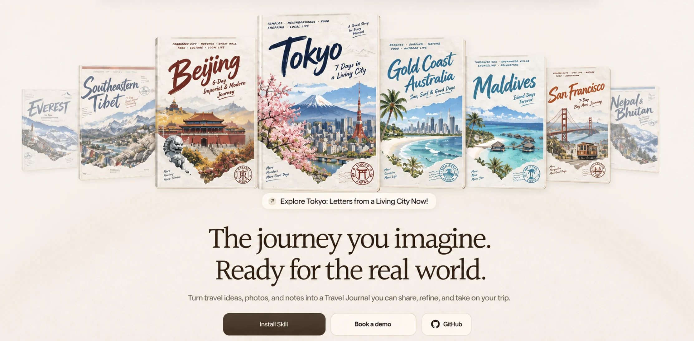
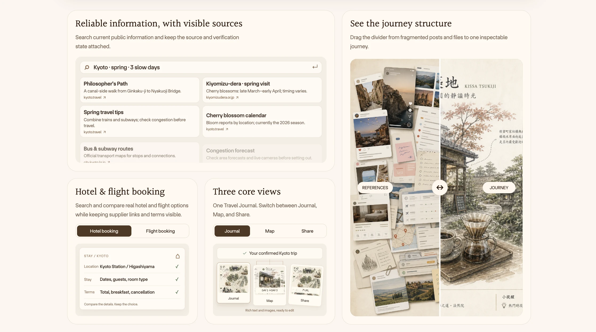
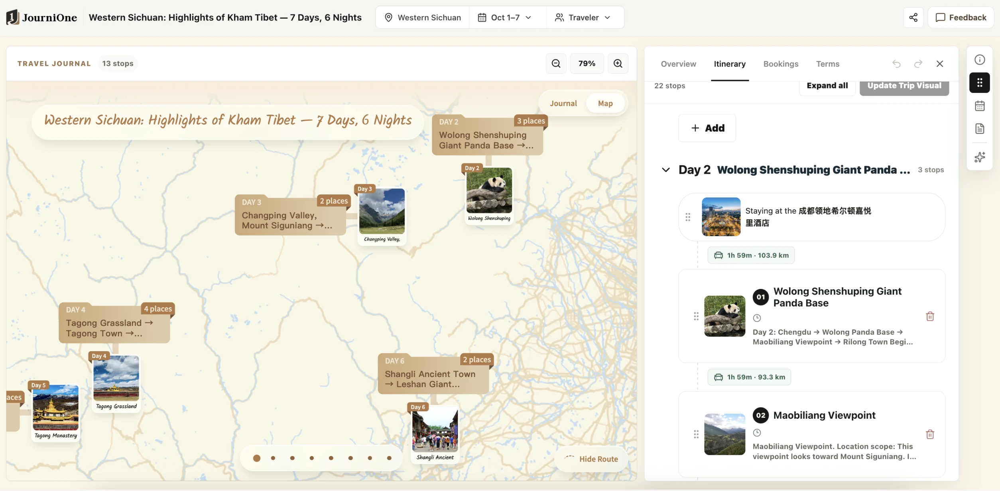
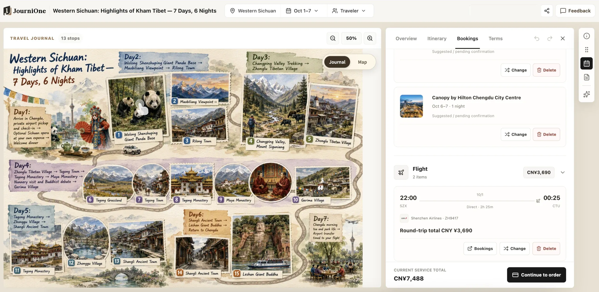
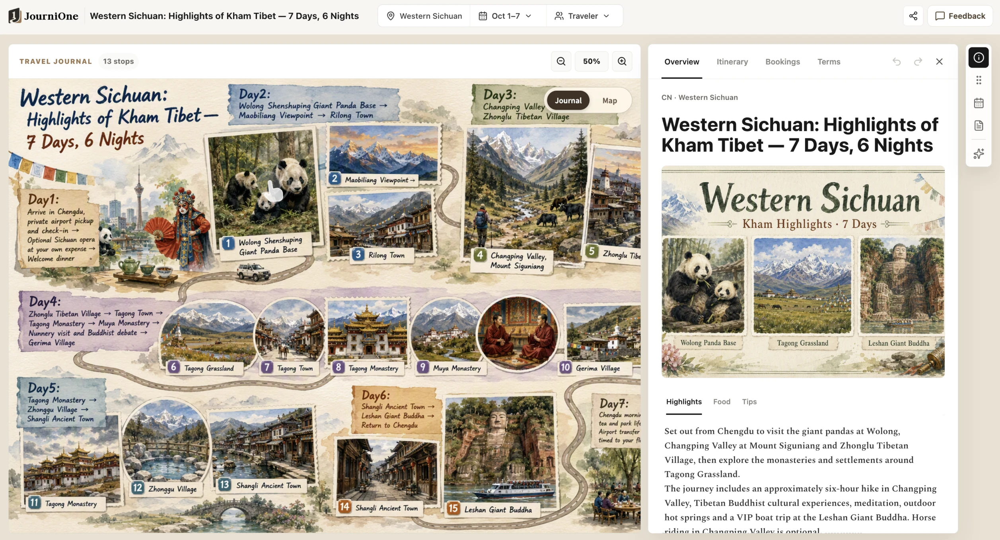

  

# JourniOne · Travel Journal Creator

[English](README.md) · [简体中文](README.zh-CN.md) · **[日本語](README.ja.md)** · [Español](README.es.md) · [한국어](README.ko.md) · [Français](README.fr.md) · [العربية](README.ar.md)

**行きたい場所を、本当に出かけられる旅に。**

[公式サイト](https://journione.ai/) · [インストール](INSTALL.md) · [使用例](EXAMPLES.md) · [よくある質問](FAQ.md)

旅のアイデアをひと言伝えるところから。JourniOne は毎日の過ごし方を組み立て、ルートと予算に合うホテルを探し、旅全体を美しく、詳しく見られて共有もできる **Travel Journal — インタラクティブな旅行ガイド**にまとめます。フリップブックをめくるように旅を眺めながら、下調べの手間を減らし、目的地をもっと知り、予算を上手に使えます。

## アイデアから、実際に歩ける旅の計画へ

行き先、好きなこと、一緒に旅する人を教えてください。既存の旅程や写真、資料から始めることもできます。JourniOne は興味やペースに合わせて日ごとのルートを考え、主要な場所や交通を確認し、観光、食事、移動、休憩を無理なくつなぎます。

計画を確認すると、旅行手帳のように細部まで見られるビジュアルガイドになります。**Journal ビュー**では写真や文章、毎日の予定を、**Map ビュー**では場所とルートを確認できます。気になる場所を開けば詳しい情報も。出発前の下調べにも、旅先で次の予定を確認するときにも使えます。

*場所の位置関係を、毎日の予定や交通と照らし合わせて確認できます。*

日付や航空券、ホテルが決まっていなくても、先にルートを組めます。いつでも調整し、準備ができたら「この内容で旅行ガイドを作って」と伝えてください。

## ホテル料金を比較し、合う宿を予約する

JourniOne は **TourMind のホテル検索・予約サービス**を通じて、Ctrip（携程）、Fliggy（飛猪）、Meituan（美団）、Tongcheng（同程）、Qunar（去哪児）、Agoda、Expedia、Booking.com など、世界100以上のホテル販売チャネルを集約した料金を検索します。ルート、宿泊の好み、予算に照らして取得できた最新料金を比較し、条件に合う宿を提案します。

比較するのは表示価格だけではありません。部屋タイプ、食事、税金、キャンセル条件、空室状況も確認します。おすすめの理由、総額、予約前の注意点を説明し、対象チャネル、料金、在庫は実際の検索結果に従います。

ホテルを選んだら、対応する予約チャネルで手続きを続けられます。部屋、金額、条件を確認し、必要な認証と支払いを済ませたうえで、予約確認結果を確認してください。予約の履行は該当するプラットフォームと供給事業者が契約条件に基づいて行い、変更・キャンセル・アフターサポートには選択した部屋と注文の規定が適用されます。

航空券が必要な場合、JourniOne が候補を検索・比較し、**TourMind Booking Skills** がホテルとあわせて航空券の検索・運賃確認・予約を補います。発着時刻、空港アクセス、宿泊を同じ旅程に反映します。認証は必要な段階で案内し、予約と支払いはそれぞれ確認後に進めます。

*ホテルも航空券も同じガイドに。画像内の価格や状態は画面の紹介用です。*

## 旅のアイデアを共有する

ガイド、旅程カード、共有リンクを友人に送ったり、SNS に投稿したりできます。旅の楽しさだけでなく、毎日何をするのか、どこに行くのかも伝わり、一緒に計画を相談したり、次の旅のヒントにしたりできます。

*詳しく見られる図文ガイドで、ルートや旅の魅力が友人にも伝わります。*

旅程リンクはログインなしで閲覧できます。ログインすると自分のログとして保存し、調整を続け、ページから共有できます。日ごとの Google Maps ルートでは、その日の場所と順序を確認できます。画像や地図の表示は実際のページをご確認ください。

共有前に、公開したくない個人情報、写真、資料の内容を除いてください。公開リンクを知っている人は内容にアクセスできる場合があります。[プライバシーと共有](PRIVACY.md)をご覧ください。

## 始め方

1. クライアントの Skill 管理画面から [JourniOne-Planning-Skills](https://github.com/JourniOne-ai/JourniOne-Planning-Skills) を導入するか、[インストール手順](INSTALL.md)に従ってリリースパッケージを利用します。表示名は **Travel Journal Creator** です。
2. ホテルと航空券の一括予約機能を持つ **TourMind Booking Skills** を主要な依存機能として導入します。Kiwi.com 航空券検索（MCP）などの比較ツールも追加できます。Agent が可能な限り自動で準備し、操作が必要な場合だけ簡潔に案内します。
3. Skill 名を入力せず、自然に旅行の希望を伝えてください。遊び方と日程を見ながら調整し、確認後にガイドを生成します。ホテルや航空券は必要に応じて検索・予約できます。

ガイド作成に JourniOne Token やローカルの JourniOne MCP サービスは不要です。既定の接続先は [journione.ai](https://journione.ai/) です。同梱スクリプトには Node.js 22 以降が必要で、クライアントにはウェブ検索、ファイル読み取り、HTTPS リクエスト、リモート MCP の対応が必要です。ホテル予約と支払いの認証は各チャネルの規定に従います。[依存関係](DEPENDENCIES.md)をご覧ください。

## こんなふうに話しかけてください

> 東京に4日間行きたい。ジャズと街歩きが好きだけど、毎日ライブには行かなくていい。まず2つの楽しみ方を見せて。日付は後で決めます。

> この京都の旅程をもう少しゆったりさせて。予約済みの予定は残し、ルートに合う、交通が便利で無料キャンセルできるホテルを探して。

> このホテルの今予約できる部屋について、総額とキャンセル条件を比較し、私に合うものを薦めて。まだ予約はしないで。

> この内容でガイドを作って。友人に送って、毎日の予定を一緒に見たい。

ほかの場面は[使用例](EXAMPLES.md)へ。

## バージョンとヘルプ

パッケージのバージョンは **1.0.1** です。公開準備と過去のオンライン検証記録は[リリースチェックリスト](RELEASE-CHECKLIST.md)にあります。日付付きの確認は当時の記録であり、現在の稼働状況を示すものではありません。生成、検索、予約の結果は各サービスの応答に従います。

[よくある質問](FAQ.md) · [変更履歴](CHANGELOG.md) · [依存関係](DEPENDENCIES.md) · [Agent 向け手順](SKILL.md)
