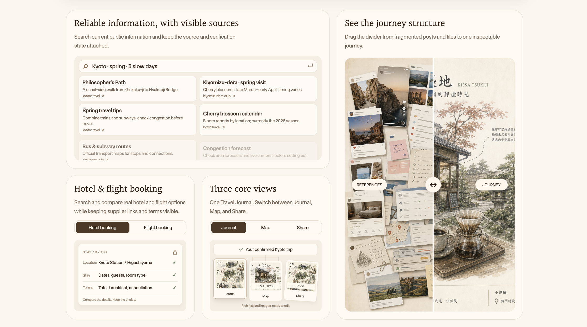
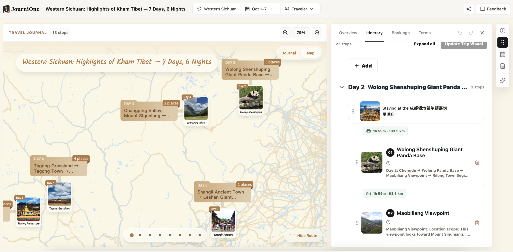
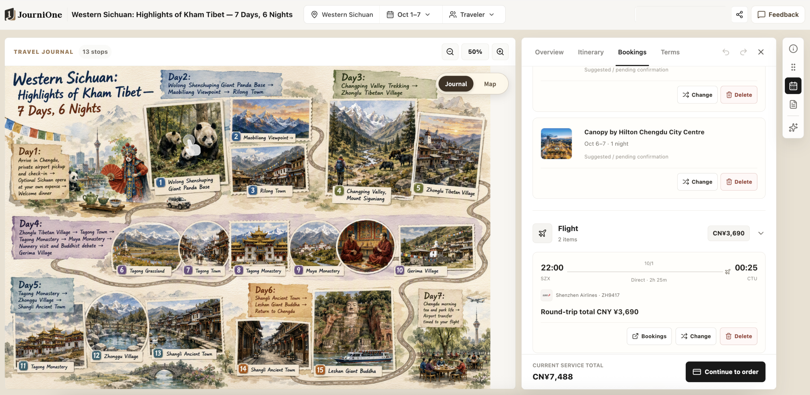
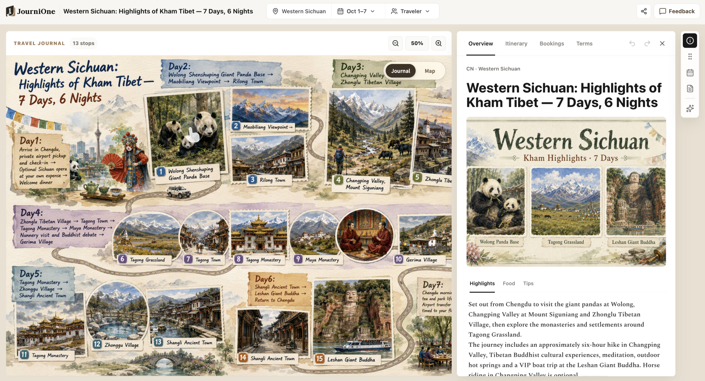

  

# JourniOne · Travel Journal Creator

[English](README.md) · [简体中文](README.zh-CN.md) · [日本語](README.ja.md) · [Español](README.es.md) · **[한국어](README.ko.md)** · [Français](README.fr.md) · [العربية](README.ar.md)

**가고 싶은 곳을, 실제로 떠날 수 있는 여행으로.**

[공식 웹사이트](https://journione.ai/) · [설치 안내](INSTALL.md) · [사용 예시](EXAMPLES.md) · [자주 묻는 질문](FAQ.md)

여행 아이디어 한마디로 시작하세요. JourniOne은 매일 무엇을 할지 계획하고, 동선과 예산에 맞는 호텔을 찾고, 여행 전체를 아름답게 살펴보고 공유할 수 있는 **Travel Journal 인터랙티브 여행 가이드**로 만듭니다. 플립북을 넘기듯 여행을 둘러보세요. 정보를 모으는 시간은 줄이고, 목적지는 더 깊이 이해하며, 예산은 더 알차게 쓸 수 있습니다.

## 아이디어에서 실제로 따라갈 수 있는 일정으로

어디로 가고 싶은지, 무엇을 좋아하는지, 누구와 떠나는지 알려주세요. 기존 일정이나 사진, 자료를 전달해도 됩니다. JourniOne은 취향과 여행 속도에 맞춰 일별 동선을 짜고, 주요 장소와 교통편을 확인하며, 관광과 식사, 이동, 휴식 시간을 함께 고려합니다.

일정을 확정하면 여행 수첩처럼 자세히 살펴볼 수 있는 시각적 가이드가 됩니다. **Journal 보기**에서는 사진과 글, 매일의 계획을, **Map 보기**에서는 장소와 경로를 확인하세요. 관심 있는 장소를 열면 더 많은 정보를 볼 수 있습니다. 출발 전에는 여행지를 알아보고, 여행 중에는 다음 일정을 확인할 수 있습니다.

*장소의 위치를 지도에서 보고, 매일의 일정 및 교통편과 함께 확인하세요.*

날짜를 정하지 않았거나 항공권·호텔을 예약하지 않았어도 동선부터 짤 수 있습니다. 언제든 수정하고, 준비되면 “이 일정으로 여행 가이드를 만들어 줘”라고 말하세요.

## 호텔 요금을 비교하고 알맞은 숙소 예약하기

JourniOne은 **TourMind 호텔 검색·예약 서비스**를 통해 Ctrip, Fliggy, Meituan, Tongcheng, Qunar, Agoda, Expedia, Booking.com 등 전 세계 100개 이상의 호텔 판매 채널을 통합한 요금을 조회합니다. 조회 가능한 채널의 실시간 가격을 동선, 숙박 취향, 예산과 비교해 적합한 숙소를 추천합니다.

표시된 가격만 비교하지 않습니다. 객실 유형, 식사, 세금, 취소 조건, 예약 가능 여부도 함께 살펴봅니다. 추천 이유, 총비용, 예약 전 확인할 사항을 설명하며, 채널 범위와 요금, 재고는 실제 검색 결과를 기준으로 합니다.

호텔을 선택한 뒤 지원되는 예약 채널에서 예약을 진행할 수 있습니다. 객실과 금액, 약관을 확인하고 필요한 인증과 결제를 마친 후 예약 확인 결과를 확인하세요. 해당 플랫폼과 공급업체가 약정에 따라 예약을 이행하며, 변경·취소와 사후 지원에는 선택한 객실 및 주문 조건이 적용됩니다.

항공권이 필요하면 **Kiwi.com**에서 검색하고, 도착·출발 시각과 공항 이동, 숙박을 같은 일정에 연결할 수 있습니다. 호텔과 항공편은 필요할 때만 조회합니다. 가이드를 만들거나 후보를 임시 선택하는 것만으로 예약하지 않습니다.

*호텔과 항공편도 같은 가이드에서 관리합니다. 화면의 가격과 상태는 인터페이스 설명용입니다.*

## 여행 아이디어 공유하기

가이드, 일정 카드, 공유 링크를 친구에게 보내거나 소셜 미디어에 올려보세요. 다른 사람도 여행 아이디어를 즐기고, 매일 무엇을 할지와 각 장소가 어디인지 알 수 있습니다. 함께 계획을 논의하는 출발점이나 다음 여행의 영감이 됩니다.

*자세히 탐색할 수 있는 시각적 가이드로 친구에게 동선과 여행의 매력을 전하세요.*

여행 링크는 로그인 없이 볼 수 있습니다. 로그인하면 자신의 여행 로그로 저장하고, 계속 수정한 뒤 페이지에서 공유할 수 있습니다. Google Maps 일별 경로로 그날의 장소와 순서를 확인하세요. 이미지와 지도의 실제 표시는 해당 페이지를 기준으로 합니다.

공유하기 전에 공개하고 싶지 않은 개인정보, 사진, 문서 내용을 제거하세요. 공개 링크를 가진 사람은 내용에 접근할 수 있습니다. [개인정보와 공유 안내](PRIVACY.md)를 확인하세요.

## 시작하기

1. 클라이언트의 Skill 관리 화면에서 [JourniOne-Planning-Skills](https://github.com/JourniOne-ai/JourniOne-Planning-Skills)를 가져오거나, [설치 안내](INSTALL.md)에 따라 배포 패키지를 사용하세요. 표시 이름은 **Travel Journal Creator**입니다.
2. 설치 Agent가 필수 항목인 **TourMind 호텔 Skill**과 **Kiwi MCP**를 확인하고 준비합니다. 이미 있는 기능은 재사용하며, 권한 승인·수동 조작·새로고침이 필요할 때만 안내합니다. 클라이언트가 두 항목을 모두 발견할 수 있어야 초기화가 완료됩니다.
3. Skill 이름을 입력하지 말고 자연스럽게 여행 요구를 말하세요. 여행 방향과 일별 계획을 보고 수정한 뒤 확정하면 가이드를 만듭니다. 호텔과 항공편은 필요에 따라 조회하고 예약합니다.

가이드 생성에는 JourniOne Token이나 로컬 JourniOne MCP 서비스가 필요하지 않습니다. 기본 연결 주소는 [journione.ai](https://journione.ai/)입니다. 포함된 스크립트는 Node.js 22 이상이 필요하며, 클라이언트는 웹 검색, 파일 읽기, HTTPS 요청, 원격 MCP를 지원해야 합니다. 호텔 예약과 결제 인증은 해당 채널의 규정을 따릅니다. [의존성 안내](DEPENDENCIES.md)를 참고하세요.

## 이렇게 말해보세요

> 도쿄에 4일 동안 가고 싶어. 재즈와 동네 산책을 좋아하지만 매일 공연을 보고 싶지는 않아. 먼저 두 가지 여행 방향을 보여줘. 날짜는 나중에 정할게.

> 이 교토 일정을 좀 더 여유롭게 바꿔줘. 예약한 활동은 유지하고, 동선에 맞으면서 교통이 편리하고 무료 취소가 가능한 호텔을 찾아줘.

> 이 호텔에서 지금 예약 가능한 객실의 총액과 취소 조건을 비교해줘. 나에게 가장 잘 맞는 것을 추천하되 아직 예약하지 마.

> 이 버전으로 여행 가이드를 만들어줘. 친구에게 보내서 매일의 계획을 함께 보고 싶어.

더 많은 상황은 [사용 예시](EXAMPLES.md)에서 볼 수 있습니다.

## 버전과 도움말

패키지 버전은 **1.0.1**입니다. 배포 준비와 과거 온라인 검증 기록은 [출시 점검표](RELEASE-CHECKLIST.md)를 확인하세요. 날짜가 표시된 검증은 당시의 기록이며 현재 서비스 상태를 나타내지 않습니다. 생성, 검색, 예약 결과는 각 서비스의 실제 응답을 기준으로 합니다.

[자주 묻는 질문](FAQ.md) · [변경 이력](CHANGELOG.md) · [의존성 안내](DEPENDENCIES.md) · [Agent 사용 지침](SKILL.md)
